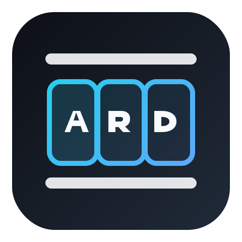
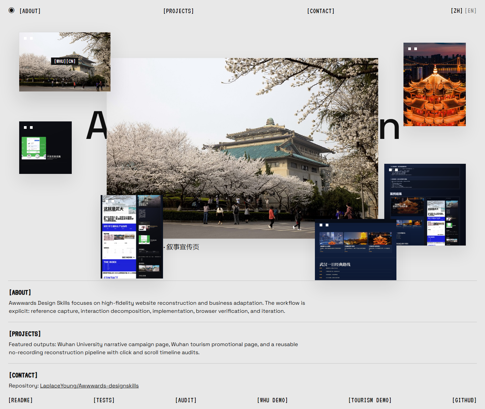
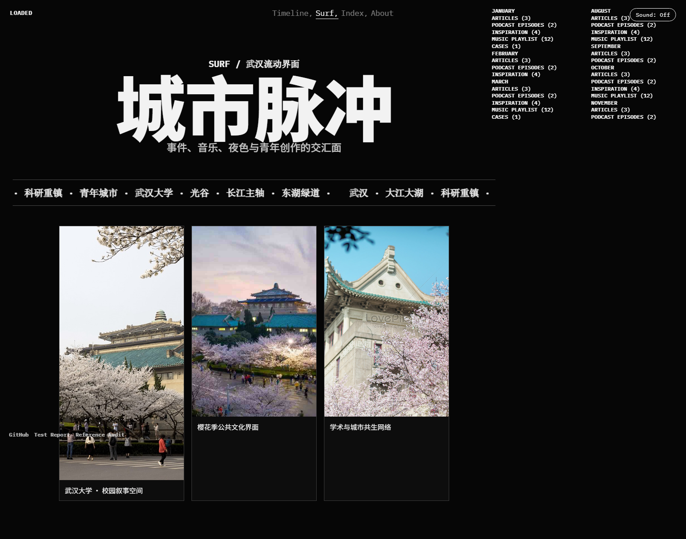
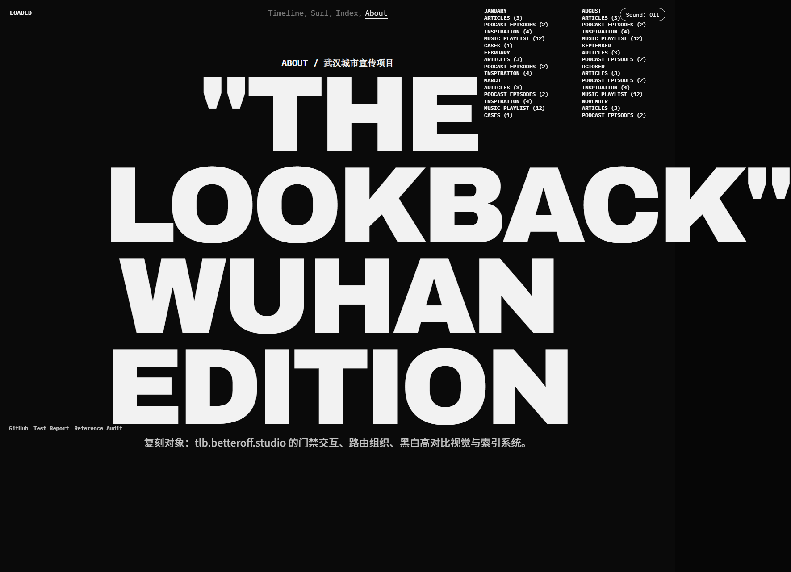

# Awwwards Design Skills

<p align="center">
  
</p>

<p align="center">
  High-fidelity Awwwards-style reconstruction workflow with real-site evidence capture, animation parity checks, and intent-aware adaptation.
</p>

<p align="center">
  <a href="./README.md"><strong>English</strong></a> · <a href="./README.zh-CN.md"><strong>简体中文</strong></a>
</p>

[](https://github.com/LaplaceYoung/Awwwards-designskills/actions/workflows/deploy-pages.yml)
[](https://laplaceyoung.github.io/Awwwards-designskills/)
[](https://nodejs.org/)
[](https://playwright.dev/)
[](./LICENSE)

## Live

- Skill landing page: [https://laplaceyoung.github.io/Awwwards-designskills/](https://laplaceyoung.github.io/Awwwards-designskills/)
- TLB Wuhan demo: [https://laplaceyoung.github.io/Awwwards-designskills/demos/wuhan-tourism-tlb/](https://laplaceyoung.github.io/Awwwards-designskills/demos/wuhan-tourism-tlb/)

## What This Skill Covers

- Real target URL extraction (avoid gallery/navigation mismatch)
- No-recording mode with MCP/Playwright visual evidence
- Interaction decomposition (`before -> after-short -> after-long`)
- Scroll/motion replication gates and smoke tests
- Intent-aware media replacement and localization-first adaptation

## Demo Test Screenshots

### Skill Landing Smoke



### TLB Wuhan Demo - Surf



### TLB Wuhan Demo - About



## Prompt Samples

### Sample 1: Zero-shot default (current-year top-score)

```text
Use awwwards-design-selector to redesign my landing page.
No reference URL provided. Apply the default policy (current-year top-score winner),
then deliver a Chinese-first marketing page with full motion parity.
```

### Sample 2: Explicit site replication with business migration

```text
Replica target: https://tlb.betteroff.studio/
Build a >=90 fidelity demo and migrate content to Wuhan city promotion.
Replace media and background audio intentionally.
```

### Sample 3: Existing content enhancement

```text
Use existing WHU content in docs/demos/whu-promo-gq-hifi.
Keep structure and motion language, upgrade typography, scroll timeline,
and click-state choreography to match the selected reference site.
```

## Validation Commands

```bash
npm install
node scripts/capture_no_recording_evidence.js --url "https://tlb.betteroff.studio/" --site-id tlb-betteroff-live --frames 12
node scripts/pre_delivery_smoke_test.js --page docs --out docs/pre-delivery-smoke.json
node scripts/pre_delivery_smoke_test.js --page docs/demos/wuhan-tourism-tlb --out docs/demos/wuhan-tourism-tlb/pre-delivery-smoke.json
node scripts/pre_delivery_smoke_test.js --page docs/demos/whu-promo-gq-hifi --out docs/demos/whu-promo-gq-hifi/pre-delivery-smoke.json
```

## Repo Structure

```text
.github/workflows/                 # GitHub Pages deployment
assets/                            # Skill templates + README icon
docs/                              # Published Pages root
  index.html                       # Skill promotion landing
  demos/                           # Replica demos
  assets/                          # Test screenshots and media
output/awwwards-design-selector/   # Runtime evidence and generated outputs
references/                        # Scoring rules and playbooks
scripts/                           # Capture / ranking / review / smoke scripts
SKILL.md
```

## Notes

- This repository focuses on structure/motion/interaction similarity for engineering demos.
- Do not ship protected third-party brand assets without rights.
